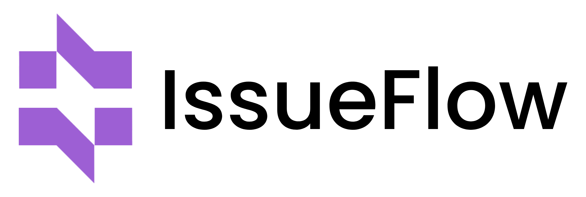

<p align="center">
  
</p>

<h1 align="center">IssueFlow — Full-Stack Issue Tracker</h1>

<p align="center">
  A modern issue and task management platform with secure authentication, analytics, and full CRUD workflows.
</p>

---

## Table of Contents

- [Product Overview](#product-overview)
- [Key Features](#key-features)
- [Technology Stack](#technology-stack)
- [Monorepo Structure](#monorepo-structure)
- [System Architecture](#system-architecture)
- [Getting Started](#getting-started)
- [Environment Variables](#environment-variables)
- [API Documentation](#api-documentation)
- [REST API Reference](#rest-api-reference)
- [Authentication Flow](#authentication-flow)
- [Data Models](#data-models)
- [Frontend Libraries](#frontend-libraries)
- [Backend Libraries](#backend-libraries)
- [Available Scripts](#available-scripts)
- [Troubleshooting](#troubleshooting)

---

## Product Overview

**IssueFlow** is a full-stack issue tracking system designed to help teams create, monitor, and resolve issues efficiently.  
It includes:

- A **React + TypeScript** frontend with a modern dashboard UX
- A **Node.js + Express** backend with JWT-based auth
- **MongoDB** persistence using Mongoose
- Built-in **Swagger/OpenAPI** docs
- Analytics and activity logging for issue workflows

This repository is organized as a monorepo with separate frontend and backend apps:

- `issueflow-client` → Web UI
- `issueflow-api` → REST API server

---

## Key Features

### Core Product Features

- User registration and login
- Refresh-token based session continuity
- Forgot-password flow with OTP + reset token
- Profile image upload with server-side compression + Cloudinary upload
- Issue lifecycle management:
  - Create issue
  - List/search/filter issues
  - View issue details
  - Update issue metadata
  - Update status (`Resolved`, `Closed`)
  - Delete issue
- Dashboard analytics:
  - Last 7-day issue creation trend
  - Issue status counts
- Activity timeline with filters and pagination
- Swagger UI for interactive API exploration

### Frontend UX Features

- Protected routes
- Zustand-based state management
- Debounced issue search
- Status and priority filtering
- Toast notifications
- Recharts-based analytics visualizations
- Tailwind + shadcn-inspired component architecture

---

## Technology Stack

### Frontend (`issueflow-client`)

- **Framework:** React `19.2.4`
- **Build Tool:** Vite `8.0.4`
- **Language:** TypeScript `~6.0.2`
- **Styling:** Tailwind CSS `4.2.2`, tw-animate-css
- **State Management:** Zustand `5.0.12`
- **Routing:** React Router DOM `7.14.1`
- **Forms/Validation:** React Hook Form + Zod
- **Charts:** Recharts `3.8.0`
- **DnD:** `@dnd-kit/*`
- **UI Primitives:** Base UI / Radix ecosystem + shadcn tooling

### Backend (`issueflow-api`)

- **Runtime:** Node.js (ES Modules)
- **Framework:** Express `5.2.1`
- **Database:** MongoDB + Mongoose `9.4.1`
- **Security:** JWT (`jsonwebtoken`), password hashing (`bcrypt`)
- **Uploads:** Multer + Sharp
- **API Docs:** swagger-jsdoc + swagger-ui-express
- **Config:** dotenv
- **Dev Runtime:** nodemon

### Containerization

- Dockerfile for API
- Docker Compose service for API container runtime

---

## Monorepo Structure

```text
IssueFlow-Full-Stack-Issue-Tracker/
├── README.md
├── issueflow-api/
│   ├── src/
│   │   ├── app.js
│   │   ├── config/
│   │   ├── controllers/
│   │   ├── middleware/
│   │   ├── models/
│   │   └── routes/
│   ├── Dockerfile
│   ├── docker-compose.yml
│   └── package.json
└── issueflow-client/
    ├── public/
    │   ├── logo-primary.png
    │   └── logo-primary-w.png
    ├── src/
    │   ├── components/
    │   ├── pages/
    │   ├── services/
    │   ├── stores/
    │   ├── lib/
    │   └── types/
    └── package.json
```

---

## System Architecture

### High-Level Flow

1. User interacts with React SPA (`issueflow-client`)
2. Frontend sends API requests to `VITE_API_BASE_URL`
3. API (`issueflow-api`) authenticates JWT and processes business logic
4. MongoDB stores users, issues, and activity logs
5. Dashboard endpoints aggregate issue analytics
6. Swagger UI exposes interactive endpoint docs at `/api-docs`

### API Base Paths

- Health: `/api/health`
- Versioned endpoints: `/v1/api/*`
- Swagger UI: `/api-docs`

---

## Getting Started

## 1) Prerequisites

- Node.js `>=20` recommended
- pnpm (recommended), npm also works
- MongoDB instance (local or cloud)
- (Optional) Cloudinary account for profile image uploads

## 2) Clone repository

```bash
git clone <your-repo-url>
cd IssueFlow-Full-Stack-Issue-Tracker
```

## 3) Install dependencies

### Backend

```bash
cd issueflow-api
pnpm install
```

### Frontend

```bash
cd ../issueflow-client
pnpm install
```

## 4) Configure environment variables

Create:

- `issueflow-api/.env`
- `issueflow-client/.env`

Use the variables listed in the [Environment Variables](#environment-variables) section.

## 5) Run the applications

### Start API

```bash
cd issueflow-api
pnpm dev
```

API default URL: `http://localhost:3001`

### Start Frontend

```bash
cd issueflow-client
pnpm dev
```

Frontend default URL (Vite): usually `http://localhost:5173`

---

## Environment Variables

## Backend (`issueflow-api/.env`)

| Variable | Required | Description | Example |
|---|---:|---|---|
| `PORT` | No | API port (defaults to `3001`) | `3001` |
| `MONGO_URI` | Yes | MongoDB connection string | `mongodb://localhost:27017/issueflow` |
| `JWT_SECRET` | Yes | Access token signing secret (also fallback for refresh secret) | `super-secret` |
| `JWT_ACCESS_EXPIRES_IN` | No | Access token TTL | `15m` |
| `JWT_REFRESH_SECRET` | No | Refresh token signing secret (falls back to `JWT_SECRET`) | `refresh-secret` |
| `JWT_REFRESH_EXPIRES_IN` | No | Refresh token TTL | `7d` |
| `OTP_EXPIRY_MINUTES` | No | Forgot-password OTP expiry | `10` |
| `RESET_TOKEN_EXPIRY_MINUTES` | No | Password reset token expiry | `15` |
| `CLOUDINARY_UPLOAD_URL` | Conditionally | Cloudinary upload config (required for `/upload-image`) | `cloudinary://<api_key>:<api_secret>@<cloud_name>` |
| `CLOUDINARY_FOLDER` | No | Cloudinary folder for uploaded images | `issueflow/profiles` |
| `IMAGE_UPLOAD_MAX_SIZE_BYTES` | No | Max upload image size bytes | `5242880` |

## Frontend (`issueflow-client/.env`)

| Variable | Required | Description | Example |
|---|---:|---|---|
| `VITE_API_BASE_URL` | Yes | Base URL for backend requests | `http://localhost:3001` |

---

## API Documentation

Swagger UI is available when API is running:

- `http://localhost:3001/api-docs`

Health check endpoint:

- `GET /api/health`

---

## REST API Reference

## Auth

- `POST /v1/api/auth/register`
- `POST /v1/api/auth/login`
- `POST /v1/api/auth/refresh-token`
- `POST /v1/api/auth/logout`
- `POST /v1/api/auth/upload-image` *(multipart: `image`)*
- `POST /v1/api/auth/forgot-password/request-otp`
- `POST /v1/api/auth/forgot-password/validate-otp`
- `POST /v1/api/auth/forgot-password/reset-password`

## Issues

- `POST /v1/api/issues` *(protected)*
- `GET /v1/api/issues` *(protected, supports `page`, `limit`, `search`, `status`, `priority`)*
- `GET /v1/api/issues/:id` *(protected)*
- `PUT /v1/api/issues/:id` *(protected)*
- `PATCH /v1/api/issues/:id/status` *(protected; allowed: `Resolved`, `Closed`)*
- `DELETE /v1/api/issues/:id` *(protected)*

## Analytics

- `GET /v1/api/analytics` *(protected)*

## Activities

- `GET /v1/api/activities` *(protected; supports `page`, `limit`, `issueId`, `userId`, `action`, `from`, `to`)*

---

## Authentication Flow

1. Login/Register returns:
   - `accessToken`
   - `refreshToken`
   - `user`
2. Frontend stores tokens in cookies.
3. Requests include `Authorization: Bearer <accessToken>`.
4. On `401`, frontend attempts silent refresh via `/v1/api/auth/refresh-token`.
5. If refresh fails, tokens are cleared and user is redirected to `/login`.

---

## Data Models

## `User`

- `name`, `email`, `password`
- `profilePictureUrl`
- `refreshTokenHash`, `refreshTokenExpiresAt`
- password reset fields and OTP throttling metadata
- timestamps

## `Issue`

- `title`, `description`
- `status` (`Open`, `In Progress`, `Resolved`, `Closed`)
- `priority` (`Low`, `Medium`, `High`)
- `severity` (`Minor`, `Major`, `Critical`)
- `createdBy`, `assignee`
- timestamps

## `ActivityLog`

- `issueId`, `userId`
- `action` (`CREATED`, `UPDATED`, `STATUS_CHANGED`)
- `details`
- indexed for query performance
- timestamps

---

## Frontend Libraries

Major runtime dependencies in `issueflow-client`:

- `react`, `react-dom`
- `react-router-dom`
- `zustand`
- `react-hook-form`, `@hookform/resolvers`, `zod`
- `tailwindcss`, `@tailwindcss/vite`
- `@tanstack/react-table`
- `recharts`
- `@dnd-kit/core`, `@dnd-kit/sortable`, `@dnd-kit/modifiers`, `@dnd-kit/utilities`
- `lucide-react`
- `next-themes`
- `sonner`
- `vaul`
- `@base-ui/react`, `radix-ui`
- utility libs: `clsx`, `class-variance-authority`, `tailwind-merge`

Dev dependencies include ESLint, TypeScript, Vite plugin for React, and related tooling.

---

## Backend Libraries

Runtime dependencies in `issueflow-api`:

- `express`
- `mongoose`
- `jsonwebtoken`
- `bcrypt`
- `cors`
- `dotenv`
- `multer`
- `sharp`
- `swagger-jsdoc`
- `swagger-ui-express`

Dev dependency:

- `nodemon`

---

## Available Scripts

## Backend (`issueflow-api/package.json`)

- `pnpm dev` → Run API with nodemon
- `pnpm start` → Run API with node

## Frontend (`issueflow-client/package.json`)

- `pnpm dev` → Start Vite dev server
- `pnpm build` → Type-check and build
- `pnpm lint` → Run ESLint
- `pnpm preview` → Preview production build

---

## Troubleshooting

- **Frontend cannot reach API:** verify `VITE_API_BASE_URL`.
- **Mongo connection fails:** verify `MONGO_URI` and network access.
- **401 after login:** check `JWT_SECRET` / token expiry settings.
- **Image upload fails:** ensure `CLOUDINARY_UPLOAD_URL` is valid and configured.
- **CORS issues:** confirm API URL origin usage and server CORS policy.
